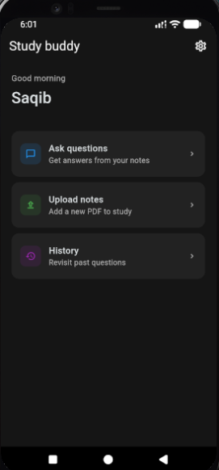
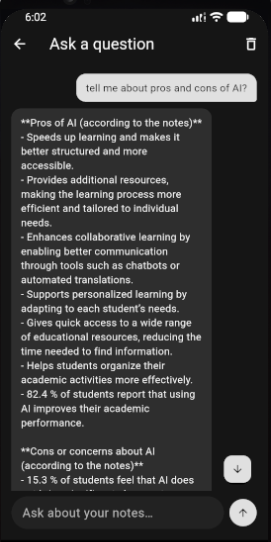
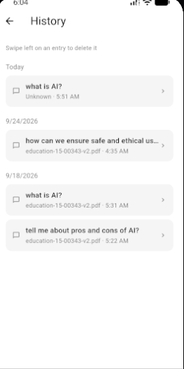
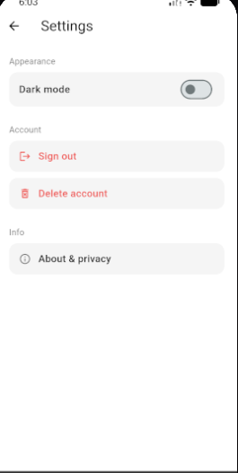
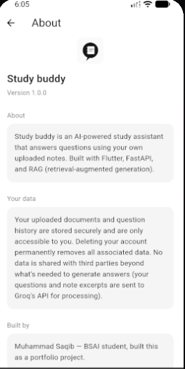

# Study Buddy

An AI-powered study assistant that answers questions from your own uploaded notes, using retrieval-augmented generation (RAG).

Built as a portfolio project to explore end-to-end AI application development, from a RAG pipeline and backend API design to a fully native, deployed mobile app.

## Features

- Upload PDF notes — typed or scanned (OCR fallback included)
- Ask questions and get answers grounded only in your own documents, with source attribution
- Persistent chat history, grouped by day, with a detail view and swipe-to-delete
- Firebase authentication with per-user data isolation
- Light and dark mode, following system theme by default, with a persisted manual override
- Full account management: sign out, delete account (wipes all associated data)

## Tech stack

- **Flutter** — cross-platform mobile UI
- **Backend**: [FastAPI + ChromaDB + Groq](https://github.com/Msaqib295/study-buddy-backend), deployed on Oracle Cloud
- **Firebase Authentication** — user accounts
- **sqflite** — local chat history persistence

## Setup

This project requires a Firebase config file that isn't included in this repo for security reasons.

1. Create a Firebase project at https://console.firebase.google.com
2. Add an Android app to it (see `android/app/build.gradle.kts` for the package name)
3. Enable Email/Password sign-in under Authentication
4. Download `google-services.json` and place it in `android/app/google-services.json`
5. Run `flutter pub get`
6. The app is pre-configured to point at the deployed backend. To run your own backend instead, update the base URL in `ask_screen.dart`, `upload_screen.dart`, and `settings_screen.dart`
7. Run `flutter run`

## Screenshots

  
  
  
  
  
  

## What I learned building this

This project took me through the full stack of building an AI application: chunking and embeddings from first principles, building and debugging a RAG pipeline, wrapping it in a REST API, building a native mobile UI with real-time chat, integrating authentication with proper per-user data scoping, and deploying to a self-managed Linux server on a free-tier cloud instance.